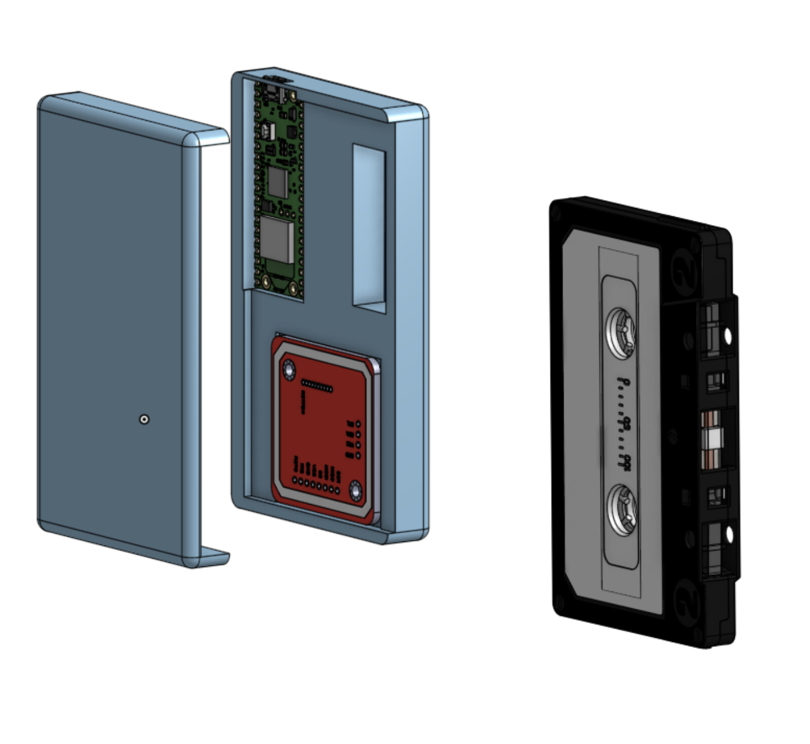
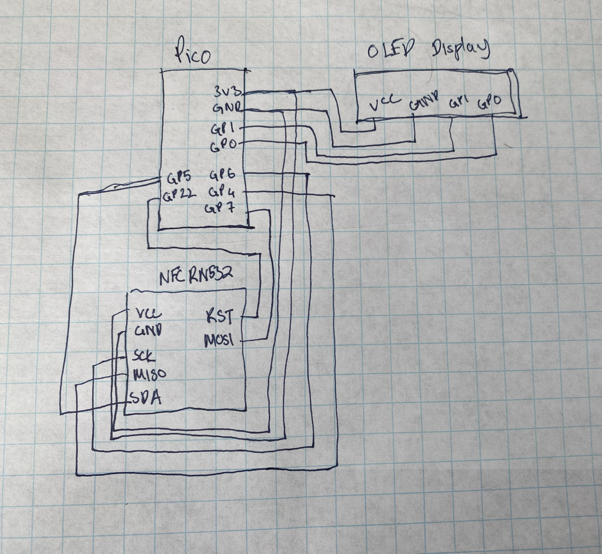

Total Hours: 5.5

20 July 2025: 2 Hours

-   started CAD. making a simple cad, something that fits the cassete tape + electronics for now. goal is find a real walkman and gut it out and embed electronics into that.
-   Did some research on parts and did a deep dive on walkmans. heres some cool videos about them lol
    -   [sony walkman commercial](https://youtu.be/7lipckhgG5g?si=Js0StyAzr2QiRBN8)
    -   [verge video](https://youtu.be/2DWtkSVNvTg?si=Ki9YeWAQCsqFfhlF)
    -   [Techmoan](https://youtu.be/8hMtcq_agWY?si=C_aE3jzZ9w3zR8_n)
-   Tried to find a place to thrift an old walkman from thrift store (unsuccessful)

25 July 2025: 1 hours

-   finished the cad
-   just made two simple parts, can be attached together by glue

-   found models for each electronic component and added them into the cad
-   also planned out the wiring and did some research on esp boards that could run the OLED display. (some boards need like a voltage stepper and such which makes things annoying)
-   decided on raspi pico because i had familiarity working on it in the past and it should work for my needs. its also pretty cheap and small and can get the job done.

**wiring diagram**

29 July 2025: 1.5 hours

-   made the journal, BOM, repo
-   started the firmware part of the project
    -   first started with connecting nfc module wo the pi, simple io pins read/write for that.
    -   implemented logic so that based on a numerical value of an nfc tag, the song/playlist played is changed.
    -   then added logic for the oled display
    -   shows debugging messages and connection with wifi as well as the current song being played. future plan is to add a nice animation for an synth wave looking player while music is being played

29 July 2025: 1 hour

-   finished the firmware part, uploaded code to the repo.
-   for the firmware, added connection with homeassistant by using the api functionality
    -   plays a certain playlist on my room's speakers by calling that device in HA and giving it a playlist ID
