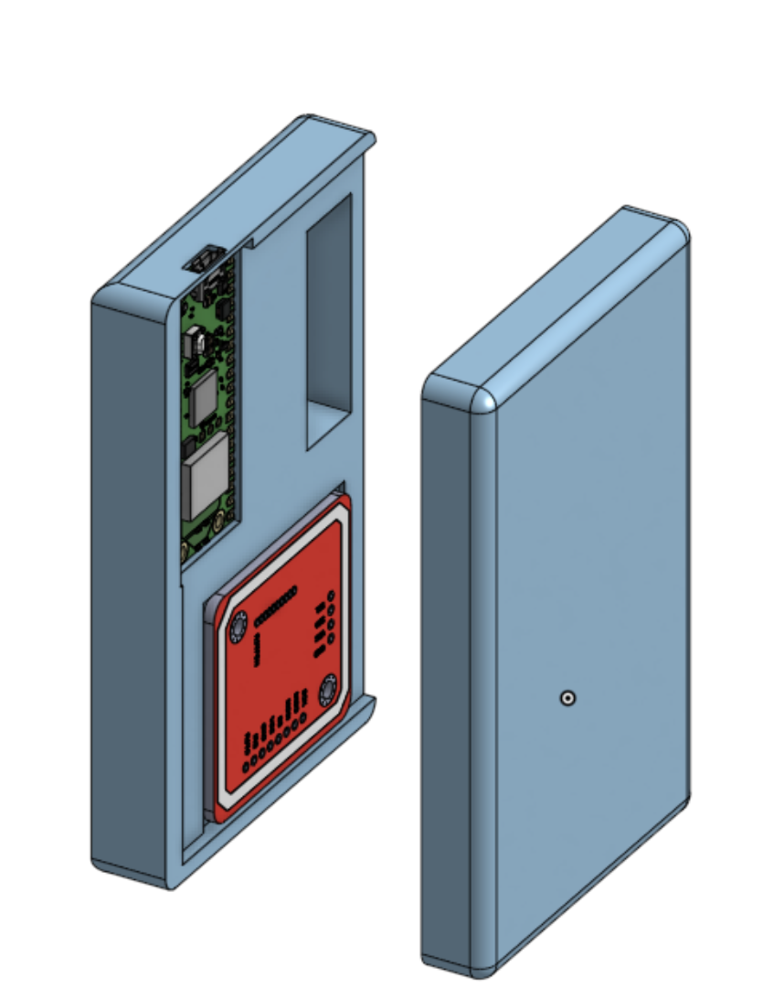

# NFC Walkman Music Player

## Inspo

Loved the walkman era and all the casette tapes so I decided to make my own modern version of one to play my playlists while I lock-in and do my work.

## Cool Features + Spec List

-   Raspi Pico W2 controller
-   RN532 NFC tag reader
-   NFC Stickers
-   0.91" OLED display

Connects with my homeassistant server so that whenever a particular cassette with a NFC sticker is inserted, it reads it and then plays the correct playlist on my speakers using homeassistant. Current 3D printed case is a temporary until I can thrift an actual cassete player which I will then gut out and replace the electronics with my current setup.

## Build Plan

1. 3D Print case
2. Connect electronics together
3. Build + customize + decorate case
4. upload custom firmware
5. listen to fire music

## Pictures

## BOM

| Item                     | Price (USD) | Link                                                            |
| ------------------------ | ----------- | --------------------------------------------------------------- |
| OLED 0.91" Display       | $12         | [Amazon](https://a.co/d/6GB8Apf)                                |
| Raspberry Pi PICO 2 W    | $9          | [PiShop.ca](https://www.pishop.ca/product/raspberry-pi-pico-w/) |
| RN532 NFC Tag Reader Kit | $12         | [Amazon](https://a.co/d/dD46keI)                                |
| NFC Stickers             | $12         | [Amazon](https://a.co/d/4Vh8Zmm)                                |
| 3D Print Parts           | Free        | Have access to a 3d printer                                     |
| Cassettes                | Free        | Have a bunch already                                            |
| TOTAL                    | $45         |                                                                 |
